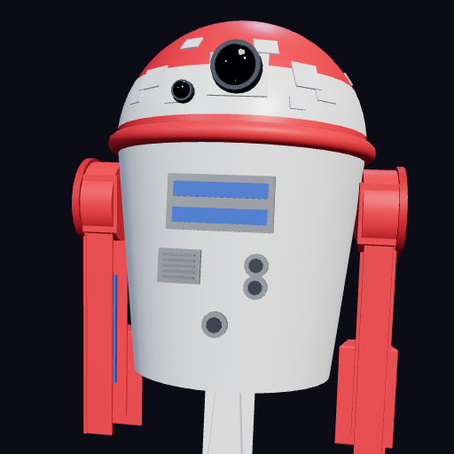

# RT91 Navi — ナビゲータードロイド

<div align="center">
  
  <p><strong>スター・ウォーズ風ドロイドが天気・時刻を教えてくれるチャットアプリ</strong></p>
</div>

---

## 📖 アプリ概要

**RT91 Navi** は、スター・ウォーズに登場するアストロメク・ドロイド（R2-D2 のような）をモチーフにした、ブラウザで動く会話型ウィジェットアプリです。

画面上に 3D で表示されたドロイドに話しかけると、天気・時刻・日付を教えてくれます。Google の Gemini AI を連携すると、より自由な会話も楽しめます。

---

## ✨ 主な機能

| 機能 | 説明 |
|------|------|
| ☀️ 天気案内 | 現在地の天気・気温・湿度・風速を表示。APIキー不要で無料 |
| ⏰ 時刻表示 | 「今何時？」と話しかけると現在時刻を教えてくれる |
| 📅 日付表示 | 「今日は何日？」で今日の日付・曜日を回答 |
| 🤖 Gemini AI連携 | Google の AI（Gemini）と接続してより自由な会話が可能 |
| 🌌 3D ビジュアル | Three.js で描かれた宇宙空間・地球・ドロイドのリアルタイム3D描画 |
| 📱 PWA対応 | スマホのホーム画面に追加するとアプリのように使える |
| 🔌 オフライン対応 | 一度開いたらオフラインでもある程度動く（Service Worker） |

---

## 🖥️ デモ

> ブラウザでそのまま開くだけで動作します。サーバーやインストールは不要！

```
index.html をダブルクリック or ブラウザにドラッグ＆ドロップ
```

または GitHub Pages 等でホスティングすることで、どこからでもアクセス可能になります。

---

## 🚀 使い方

### 1. 基本の会話（APIキー不要）

画面右下のチャット欄にメッセージを入力して ▶ ボタンか Enter を押すだけです。

```
「天気を教えて」 → 現在地の天気を表示
「今何時？」     → 現在時刻を表示
「今日は何日？」 → 今日の日付・曜日を表示
「こんにちは」   → 挨拶を返してくれる
「できること」   → 機能一覧を表示
```

> 💡 位置情報の許可を求められた場合は「許可」を選ぶと、現在地の天気が取得できます。拒否しても東京の天気が表示されます。

### 2. Gemini AI との自由会話（任意）

右上の ⚙ ボタンから **Gemini API キー** を設定すると、設定したキーワード以外の質問にも自然に回答できるようになります。

**APIキーの取得方法（無料）：**
1. [Google AI Studio](https://aistudio.google.com/app/apikey) にアクセス
2. Google アカウントでログイン
3. 「APIキーを作成」ボタンを押してコピー
4. アプリの ⚙ 画面に貼り付けて「保存して閉じる」

> 🔒 APIキーはあなたのデバイスのみに保存されます（`localStorage` を使用）。GitHubや外部サーバーには一切送信されません。

### 3. スマホのホーム画面に追加（PWA）

- **iOS Safari**: 「共有」→「ホーム画面に追加」
- **Android Chrome**: メニュー（⋮）→「アプリをインストール」または「ホーム画面に追加」

ホーム画面からアプリのように全画面で起動できます。

### 4. 3D ドロイドの操作

| 操作 | 動作 |
|------|------|
| ドラッグ | カメラを回転 |
| スクロール | ズームイン・アウト |

ドロイドは自律的にウロウロ移動し、話しかけるとカメラを向いて頭を振ります。

---

## 🛠️ 使用技術の解説（初学者向け）

### Three.js（スリーJS）— 3D描画ライブラリ
> [cdnjs.cloudflare.com から読み込んでいます]

ブラウザ上で 3D グラフィックを描くためのライブラリです。通常、ブラウザで 3D を描くには `WebGL` という低レベルの API を直接書く必要がありますが、Three.js はそれを使いやすくラップしてくれています。

- **Scene（シーン）**: 3D 空間全体。ドロイド・地球・星空がすべてここに配置されています
- **Camera（カメラ）**: 視点。ドラッグ操作で動かすのはこのカメラです
- **Mesh（メッシュ）**: 形（ジオメトリ）＋質感（マテリアル）の組み合わせ。ドロイドの各パーツはすべて Mesh です
- **Light（ライト）**: 照明。影や金属の光沢はライトがあって初めて表現されます
- **requestAnimationFrame**: ブラウザに「次の描画タイミングでこの関数を呼んで」と伝える仕組み。これをループさせることでアニメーションを実現しています

### Open-Meteo API — 天気情報（無料・APIキー不要）
> [api.open-meteo.com](https://open-meteo.com)

API（Application Programming Interface）とは、外部サービスのデータをプログラムから取得する仕組みです。Open-Meteo はオープンソースの気象データ API で、登録不要・完全無料で使えます。

```
取得する情報：気温・体感温度・湿度・風速・天気コード・最高/最低気温
```

GPS（`navigator.geolocation`）で現在地を取得し、その緯度経度を Open-Meteo に送って天気データを受け取ります。

### Gemini API — AI会話
> [Google AI Studio](https://aistudio.google.com)

Google が提供する生成 AI の API です。テキストを送ると AI が返答を生成します。このアプリでは RT91 ドロイドのキャラクターとして振る舞うように「システム指示」を与えています。会話の履歴を保持することで文脈を踏まえた自然な対話を実現しています。

### PWA（Progressive Web App）
> Service Worker + Web App Manifest

ウェブサイトをスマホアプリのように使えるようにする技術の総称です。

| 技術 | 役割 |
|------|------|
| `manifest.json` | アプリ名・アイコン・テーマカラーなどを定義。ホーム画面追加を実現 |
| `sw.js`（Service Worker） | バックグラウンドで動くスクリプト。ファイルをキャッシュしてオフラインでも動くようにする |

### localStorage — データの保存
ブラウザが提供するデータ保存機能で、サーバーなしにデータを端末に保存できます。このアプリでは Gemini API キーの保存に使っています。ブラウザを閉じても消えません。

### Canvas — 3D描画の土台・テクスチャ生成
HTML の `<canvas>` 要素は「自由に絵が描けるキャンバス」です。Three.js はこの Canvas を使って WebGL で 3D 描画を行っています。このアプリでは Canvas を 3D 描画の出力先としてだけでなく、**テクスチャの生成にも活用**しています。JavaScript の Canvas 2D API（グラデーション・図形描画）で地球の陸地テクスチャや地面の大理石タイルテクスチャを動的に生成し、`THREE.CanvasTexture` を通じて 3D マテリアルに適用しています。外部画像ファイルなしに複雑な質感を実現するのが特徴です。

### Visual Viewport API — iOS キーボード対応
iOS Safari ではソフトキーボードを開くとビューポートのサイズが変わらないため、キーボードが入力欄を隠してしまう問題があります。`window.visualViewport` を使うとキーボードの表示状態を検知でき、チャットパネルの位置を動的にずらすことでこの問題を回避しています。

---

## 💎 こだわりポイント

### 🔴 忠実な RT91 ドロイドモデル
Three.js のプリミティブ（球・円柱・箱・トーラス）を組み合わせて、手動でコードだけで作成した 3D ドロイドモデルです。赤白配色のドーム、テーパーのかかったボディ、二脚の足構造など細部まで作り込んでいます。

### 🌍 手描きの 3D 地球
テクスチャ画像を一切使わず、JavaScript で `<canvas>` に陸地ポリゴンを描いてテクスチャを生成しています。大気圏のグロー効果・スペキュラーマップ（海面の反射）・地軸の傾き（23.4°）まで再現しています。

### ☁️ 物理ベースの積雲シミュレーション
5 つの積雲を地球の大気圏上に配置しています。実際の気象物理に基づいた設計で、**凝結高度（LCL: Lifting Condensation Level）** を扁平な楕円体で再現した平坦な雲底、**対流セル**を 13 個の重なり合う球体で積み上げた雲頂（高さとともに不透明度が下がる密度勾配付き）、**Mie 散乱**近似として `roughness=1.0, metalness=0.0` の完全拡散マテリアルを使用。緯度 ±55° 以内のみに配置（極域の乾燥気候を再現）し、熱帯の積雲は大きく・中緯度の偏西風帯の雲は小さめに設定しています。雲は `earthMesh` の子要素として地球の自転に連動します。

### 🏛️ 神殿風大理石タイルの地面
512 × 512 の Canvas2D でプロシージャル生成した大理石テクスチャです。`createLinearGradient` で温かみのあるクリーム〜アイボリーのベース色を作り、半透明の細線を 18 本引いて大理石の脈模様を再現。4 × 4 のタイルグリッドを目地幅 3px で分割し、各タイルに個別の色ばらつき・ハイライト（上・左端）・シャドウ（下・右端）のベベル処理を施しています。交互タイルには控えめなダイヤモンド装飾も入り、バンプマップで目地の凹み・タイル面の微妙な膨らみを立体的に表現しています。

### 💫 3,500 個の星空
ランダム分布の点群（BufferGeometry）で宇宙空間を表現。星の色に微妙な温度差（青白〜暖色）を持たせ、ゆっくり回転させることでリアルな宇宙感を演出しています。

### 🤖 自律的なドロイドの動作
ドロイドは一定時間ごとにランダムな目標地点へ移動します（ワンダリング）。移動方向にボディを向け、速度に応じて前傾きが変わり、足が交互に揺れます。話しかけるとカメラ方向を向いて頭を振る反応アニメーションも実装しています。

### 📱 モバイルファースト設計
- 縦画面でもドロイド全体が収まるようカメラ距離をアスペクト比で自動調整
- チャット入力欄のフォントサイズを 16px 固定（iOS Safari の自動ズーム防止）
- Visual Viewport API でソフトキーボードが入力欄を隠さない制御

---

## 📁 ファイル構成

```
droid_navi/
├── index.html          # アプリ本体（HTML + CSS + JavaScript すべて含む）
├── manifest.json       # PWA マニフェスト（アプリ名・アイコン定義）
├── sw.js               # Service Worker（オフラインキャッシュ）
├── icon-192.png        # PWA アイコン（192×192）
├── icon-512.png        # PWA アイコン（512×512）
├── icon-192.svg        # アイコン元データ（SVG）
├── icon-512.svg        # アイコン元データ（SVG）
├── generate-icons.html # アイコン生成用ツール
└── generate-icons.js   # アイコン生成スクリプト
```

---

## 🌐 動作環境

- Chrome / Edge / Safari / Firefox の最新版
- スマホ・タブレット・PC すべて対応
- インターネット接続：天気取得・Gemini AI に必要（初回読み込み後はオフラインでも基本機能は動作）

---

## 📝 ライセンス

本プロジェクトは個人学習・ポートフォリオ目的で作成されています。
